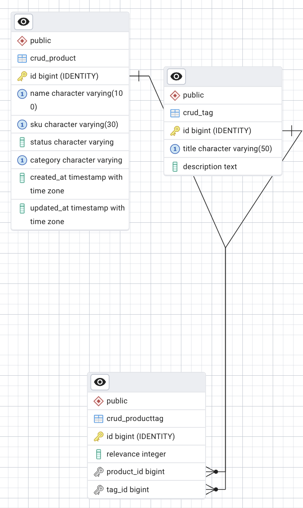

# Product CRUD con Django y PostgreSQL

## Descripción
Proyecto de ejemplo para gestionar una entidad principal (`Product`) con múltiples elementos relacionados (`Tag`) a través de una tabla intermedia (`ProductTag`), usando Django ORM y PostgreSQL.

## Requisitos
- **Python** 3.x
- **Django** (>= 3.x)
- **PostgreSQL** (>= 12)
- **psycopg2-binary** (para la conexión de Django a PostgreSQL)

## Instalación
1. Clona el repositorio:
   ```bash
   git clone <url-del-repositorio>
   cd <directorio-del-proyecto>
   ```
2. Crea y activa un entorno virtual:
   ```bash
   python -m venv env
   source env/bin/activate    # Linux/macOS
   env\Scripts\activate     # Windows
   ```
3. Instala las dependencias:
   ```bash
   pip install Django psycopg2-binary
   ```

## Configuración de la base de datos
En `settings.py`, ajusta el diccionario `DATABASES` con tus credenciales:
```python
DATABASES = {
    'default': {
        'ENGINE': 'django.db.backends.postgresql',
        'NAME': '<nombre_bd>',
        'USER': '<usuario>',
        'PASSWORD': '<contraseña>',
        'HOST': 'localhost',
        'PORT': '5432',
    }
}
```

## Migraciones y ejecución
Aplicar migraciones y levantar el servidor de desarrollo:
```bash
python manage.py migrate
python manage.py runserver
```
Accede en el navegador a `http://127.0.0.1:8000/products/` para ver la aplicación.

## Población de datos
Para cargar datos de ejemplo, ejecuta el script SQL:
```bash
psql -U <usuario> -d <nombre_bd> -f data.sql
```

## Diagrama ERD


## Modelo de datos implementado

### Product
- `id`: PK (autoincremental)
- `name` (CharField, único, NOT NULL)
- `sku`  (CharField, único, NOT NULL)
- `status`   (ENUM: draft, published, archived)
- `category` (ENUM: standard, premium, vip)
- `created_at`, `updated_at` (DateTime)
- **Constraint**: UniqueConstraint(`name`, `category`)

### Tag
- `id`: PK
- `title`       (CharField, único, NOT NULL)
- `description` (TextField, opcional)

### ProductTag (tabla intermedia)
- `id`: PK
- `product_id`: FK → `Product.id`
- `tag_id`:     FK → `Tag.id`
- `relevance`:  (PositiveInteger, rango 1–10)
- **Constraints**:
  - UniqueConstraint(`product_id`, `tag_id`)
  - CheckConstraint(1 ≤ `relevance` ≤ 10)

### ProductIndex (VIEW)
Vista no manejada en Django que agrupa `Product`, `ProductTag` y `Tag` para mostrar:
- `id`, `name`, `sku`, `status`, `category`, `created_at`, `updated_at`,
- `tags`: lista agregada de `title (relevance)` separados por comas.
